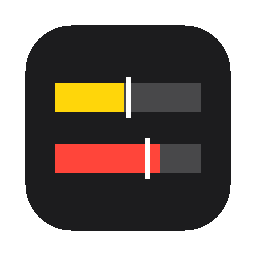
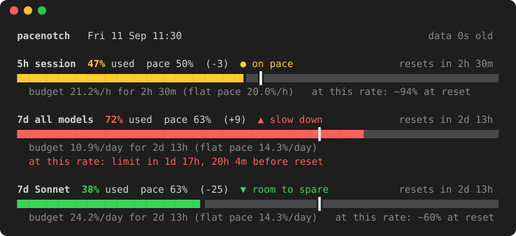
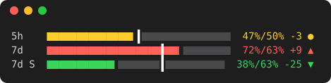
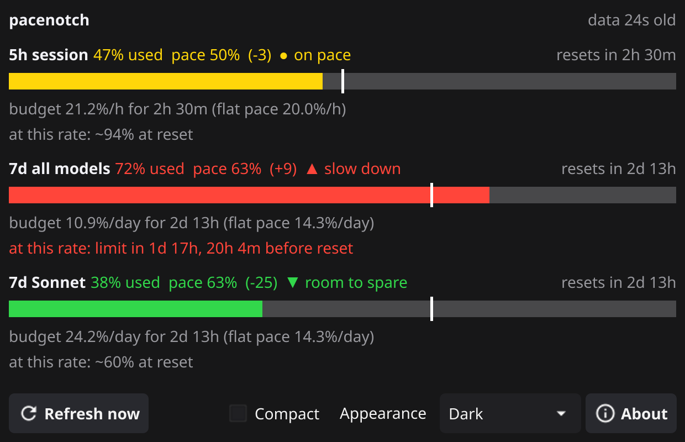
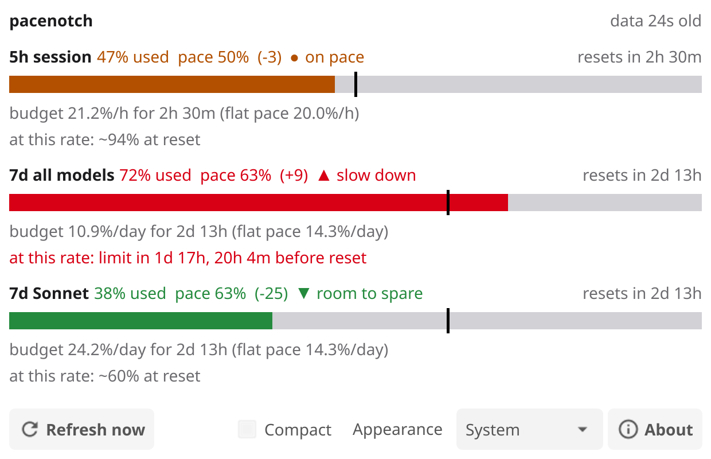
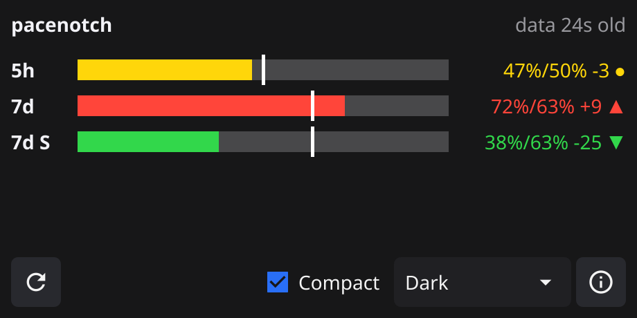
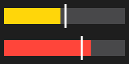
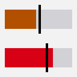
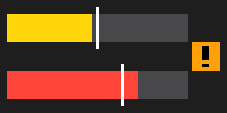

<p align="center"></p>

# pacenotch

**Claude usage limits with a vertical pace notch.**

[](https://github.com/carlok/pacenotch/actions/workflows/ci.yml)
[](LICENSE)

> Unofficial. pacenotch is not affiliated with, or endorsed by, Anthropic.

```text
 7d all models  72% used  pace 63%  (+9)  ▲ slow down         resets in 2d 13h
 █████████████████████████████████████████████████┃██████▏░░░░░░░░░░░░░░░░░░░░░
                                                  │      │
                                                  │      └─ the fill: 72% of the weekly limit used
                                                  └─ the pace notch: 63% of the week has gone by
```

The notch marks where your usage would be if you spread it evenly over the window.
**Fill past the notch:** you are ahead of pace, and at this rate you hit the limit before
the reset. **Fill short of it:** room to spare.

## Why

There are plenty of Claude usage monitors: status line scripts, menu bar apps, web
dashboards. Almost all of them show one number, percent used. That number can't answer
the question you actually have: is 60% on a Thursday fine, or a problem?

It depends on how much of the window is left. 60% of the weekly limit a day before the
reset is comfortable; 60% a day after the reset means you run dry by the weekend.
pacenotch draws the answer on the bar itself, as a thin vertical notch at the elapsed
fraction of the window, so you see at a glance which side of it the fill is on. As far
as I know, no other monitor does this.

What people use it for:

- deciding whether to start a long agentic session now or after the 5-hour reset;
- spreading a heavy week so the 7-day limit doesn't run out on Friday;
- keeping a tray icon that turns red when you burn faster than the week allows.

## Screenshots

The terminal view, and the compact view (automatic below 60 columns):





The window, in the Dark appearance (default) and in System with a light OS theme:

<p>


</p>

The compact window, one line per window:



The tray icon, scaled up 4×: 5-hour bar on top, 7-day below, each with its notch. It is
2:1 in the macOS menu bar and square on Windows and Linux; the orange badge means stale
data or a sign-in problem.

<p>
&nbsp;
&nbsp;

</p>

## What it shows

For each window (5-hour session, 7-day all models, and 7-day Sonnet or Opus when your plan
reports them):

- **used**, **pace** (the notch) and the difference, with a status: ▲ *slow down* when
  you are more than the band (default 5 points) ahead, ● *on pace* within the band,
  ▼ *room to spare* below it;
- the time until the window **resets**;
- the **budget**: how much you can spend per hour or per day for the rest of the window,
  next to the flat pace (20.0%/h for 5 hours, 14.3%/day for 7 days);
- a **projection** at the current rate: the percentage at reset, or when you would hit the
  limit and how long before the reset that is.

Windows that haven't started yet, or that reset since the data was fetched, are shown
idle, without a notch.

## Install

Download a build from [Releases](https://github.com/carlok/pacenotch/releases):

| File | What it is |
|---|---|
| `pacenotch_darwin_arm64`, `pacenotch_darwin_amd64`, `pacenotch_linux_amd64`, `pacenotch_windows_amd64.exe` | CLI only, a single static binary |
| `pacenotch-gui_macos_universal.zip` | `pacenotch.app`: menu bar app, no Dock icon |
| `pacenotch-gui_darwin_universal` | macOS CLI plus `pacenotch gui` |
| `pacenotch-gui_linux_amd64` | Linux CLI plus `pacenotch gui` (Ubuntu 22.04 or newer) |
| `pacenotch-gui_windows_amd64.exe` | Windows GUI; use `pacenotch_windows_amd64.exe` in the terminal |

Or build from source with Go 1.27 or newer:

```bash
git clone https://github.com/carlok/pacenotch && cd pacenotch
make build       # CLI-only binaries for every platform in dist/ (no cgo)
make build-gui   # native GUI build for this OS (cgo)
```

On Linux the GUI build needs `libgl1-mesa-dev xorg-dev libxkbcommon-dev libwayland-dev`.
`go install …@latest` does not work, because `go.mod` replaces the systray module with a
patched copy (see [Development](#development)).

pacenotch reads the token of a logged-in Claude Code on the same machine, so you need
Claude Code and a Pro or Max plan.

## Usage

```text
pacenotch                 full view
pacenotch -c              compact: one line per window (automatic below 60 columns)
pacenotch -w [SECS]       watch mode: redraws every SECS (default 60) and on resize
pacenotch gui             tray icon and window (GUI builds)
```

| Flag | Meaning |
|---|---|
| `-c`, `--compact` | one line per window |
| `-w`, `--watch [SECS]` | watch mode; the notch moves with time, so it redraws even without new data |
| `-b`, `--band N` | the "on pace" band in points, default 5 |
| `--ttl SECS` | how long cached data is used before fetching again, default 60 (180 in the GUI) |
| `--width N` | columns, instead of the terminal width |
| `--from FILE` | read JSON from a file (`-` for stdin) instead of the API |
| `--raw` | print the raw JSON and exit |
| `--color auto\|always\|never`, `--no-color` | colors; `auto` honours `NO_COLOR` |
| `--ascii` | `#`, `-` and `\|` instead of block characters |
| `--version`, `-h` | version, help |

Exit codes in single-shot mode: `0` fine, `1` error, `2` when *7d all models* is ahead of
pace, so scripts can react:

```bash
pacenotch -c; [ $? -eq 2 ] && echo "weekly limit: slow down"
```

`--from -` also accepts the JSON that Claude Code passes to status line commands (the
`rate_limits` object, with epoch or ISO timestamps), so you can reuse it in your own status
line script without another API call.

### GUI

`pacenotch gui [-b N] [-c] [--ttl SECS] [--from FILE]`, or open `pacenotch.app`, or run
`pacenotch-gui_windows_amd64.exe`.

- The **tray menu** has one line per window, like `7d  72% / pace 63%  ▲ slow down  · resets 2d 13h`,
  then *Open window*, *Refresh now*, *Compact window*, *Appearance* (Dark or System),
  *About* and *Quit*.
- The **window** shows the full view with bars that stretch with it, or the compact view
  (one line per window: label, bar, `72%/63% +9 ▲`) with the *Compact* switch, the tray
  menu item or `-c`. The choice is saved. Closing the window leaves the tray running.
- Everything **redraws every 60 seconds**, so the notch keeps moving; data is fetched only
  when the cache is older than `--ttl`.
- A **notification** appears once each time *7d all models* goes ahead of pace.

## Platform notes

**macOS.** The builds are signed ad hoc, not notarized, so Gatekeeper blocks them after a
download. Remove the quarantine flag once:

```bash
xattr -d com.apple.quarantine pacenotch.app
```

(or the binary you downloaded). pacenotch reads the token with
`security find-generic-password -s "Claude Code-credentials" -w`; macOS may ask you to allow
it the first time.

**Ubuntu.** The tray icon uses AppIndicator, which Ubuntu enables by default. On a GNOME
desktop without it, install the *AppIndicator and KStatusNotifierItem Support* extension.

**Windows.** One executable can't cleanly be both a console and a GUI app, so there are
two: `pacenotch_windows_amd64.exe` for the terminal and `pacenotch-gui_windows_amd64.exe`
for the tray. pacenotch turns on virtual-terminal processing for colors. If the bars show
up as boxes or question marks in an old console, use `pacenotch --ascii`.

## How it works

- **Data.** `GET https://api.anthropic.com/api/oauth/usage`, the undocumented endpoint
  behind Claude Code's usage display. It may change without notice and it rate-limits, so
  pacenotch treats every field as optional and caches the answer.
- **Token.** `PACENOTCH_TOKEN` if set; otherwise the macOS keychain; otherwise
  `~/.claude/.credentials.json` (`%USERPROFILE%\.claude\.credentials.json` on Windows).
  It is read-only: pacenotch never refreshes or writes it, and never prints or logs it
  (tests check stdout, stderr, errors and cache files for a canary token). If it has
  expired, start Claude Code once.
- **Cache.** `usage.json` in `pacenotch/` under the user cache directory
  (`~/Library/Caches` on macOS, `~/.cache` on Linux, `%LocalAppData%` on Windows). When a
  fetch fails, the cached data is shown marked **STALE** with its age and the reason.
  After HTTP 429, watch mode and the GUI back off from 5 up to 30 minutes.
- **Math.** For a window of length W with `left` seconds to the reset:
  `pace = (W − left) / W`, `delta = used − pace`, `budget = (100 − used) / (left in hours or days)`,
  and `projection = used / pace`, computed once 5% of the window has passed.

## Development

```bash
make test         # race-enabled unit tests
make test-gui     # race-enabled tests of the Fyne glue (needs cgo)
make cover        # unit + end-to-end coverage, merged, per package and per function, gated
make cover-html   # coverage.html from the merged profile
make fuzz         # short fuzz runs (CI runs 30 s per target)
make golden       # regenerate testdata/golden; review the diff
make screenshots  # README images in docs/
```

pacenotch began as a bash script, kept in `reference/claude-pace.sh`. The **parity tests**
run a copy patched only to fix the clock (`testdata/reference.sh`) and the Go binary on
every fixture at several widths, and require byte-identical output. Golden files, fuzz
tests for the timestamp and response parsers, and the token-leak tests cover the rest.

**Reading the coverage.** `make cover` ends with a gate table like this one:

```text
rule                              coverage   minimum  result
internal/pace                       100.0%      100%  ok (102/102 statements)
internal/usage                      100.0%       90%  ok (274/274 statements)
internal/tui                         99.7%       90%  ok (309/310 statements)
internal/gui(model+raster)          100.0%       90%  ok (208/208 statements)
module(unit+e2e)                     99.9%       85%  ok (906/907 statements)
```

The minimums live in `scripts/coverage-thresholds.txt`. The profile merges the unit tests
with end-to-end runs of a `go build -cover` binary, so `main` and flag handling count too.
Open `coverage.html` to see covered code in green and uncovered code in red; CI uploads one
per OS as the `coverage-<OS>` artifact. The Fyne glue (`internal/gui/*_fyne.go`) has its
own tests but no gate: everything it displays comes from the tested view-model and bar
rasterizer.

**Layout.** `internal/usage` (credentials, fetch, cache, parsing), `internal/pace` (the
math), `internal/tui` (terminal renderer, watch mode), `internal/gui` (view-model, the one
bar rasterizer shared by window and tray, Fyne glue), `e2e`, `cmd/pacenotch`,
`cmd/pacenotch-gui`.

**Vendored systray.** Fyne's tray code forces macOS menu bar icons into a 16×16-point
square. `third_party/systray` is `fyne.io/systray` with a two-line patch that keeps the
aspect ratio, so the menu bar icon can be 2:1; see
[`PACENOTCH_PATCH.md`](third_party/systray/PACENOTCH_PATCH.md).

## Credits

Written by Carlo Perassi. Built with [Go](https://go.dev) and [Fyne](https://fyne.io),
including a patched copy of [fyne.io/systray](https://github.com/fyne-io/systray)
(Apache 2.0). Claude is a trademark of Anthropic; this project is unofficial.

## License

[MIT](LICENSE)
